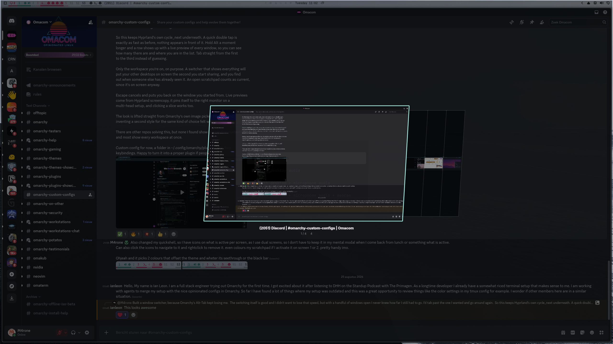
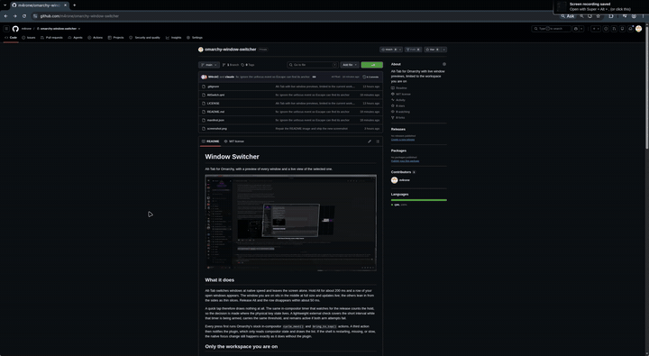
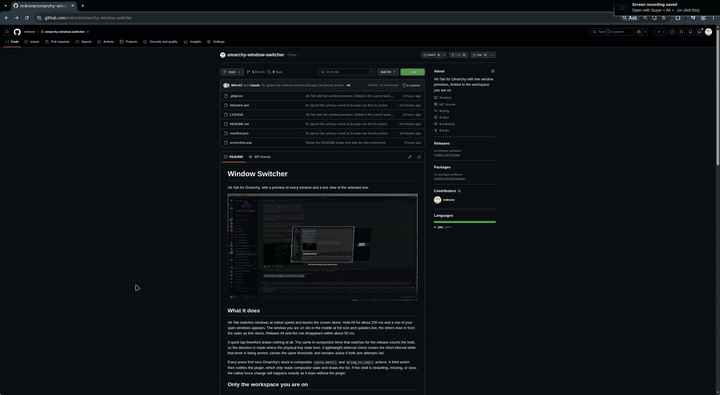
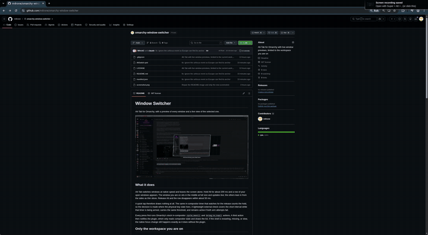

# SliceTab

Alt-Tab for Omarchy, with a preview of every window and a live view of the
selected one.



## See it move

A quick tap switches at native speed and never touches the screen:



Hold Alt and the row appears; keep tabbing to browse the live previews:



Escape while holding Alt cancels and returns you to the window you came from:



## What it does

Alt-Tab switches windows at native speed and leaves the screen alone. Hold Alt
for about 200 ms and a row of your open windows appears. The window you are on
sits in the middle at full size and updates live; the others lean in from the
sides as thin slices. Release Alt and the row disappears within about 50 ms.

A quick tap therefore draws nothing at all. The same in-compositor timer that
watches for the release counts the hold, so the decision is made where the
physical key state lives. A lightweight external check covers the short interval
while that timer is being armed, carries the same threshold, and remains active
if both arm attempts fail.

Every press first runs Omarchy's stock in-compositor `cycle_next()` and
`bring_to_top()` actions. A third action then notifies the plugin, which only
reads compositor state and draws the list. If the shell is restarting, missing,
or slow, the native focus change still happens exactly as it does without the
plugin.

## Only the workspace you are on

The row lists windows from the workspace that currently holds focus, and nothing
else. If you are in a scratchpad, you see the scratchpad.

That is a deliberate limit, not a missing feature. A switcher that shows every
workspace will, during a screen share, put the contents of your other desktops
on someone else's monitor. By the time you notice, they have already seen it.
The list is rebuilt from the compositor on every press, and relevant compositor
events discard it promptly when windows, workspaces, scratchpads, or monitors
change.

## Install

```bash
omarchy plugin add https://github.com/m4rone/omarchy-slicetab.git --enable
```

Then add the notification actions below to `~/.config/hypr/bindings.lua`:

```lua
o.bind("ALT + TAB", "Show SliceTab", "omarchy-shell -q m4rone.slicetab next")
o.bind("ALT + SHIFT + TAB", "Show SliceTab", "omarchy-shell -q m4rone.slicetab prev")
o.bind("ALT + ESCAPE", "Cancel SliceTab", "omarchy-shell -q m4rone.slicetab cancelKey")
```

The third line is optional and strongly recommended. Add it and skip the rest of
this section; the reason follows for anyone who wants it.

Escape cancels with or without that line. Without it, the plugin has to read the
physical key state every 50 ms, because the overlay takes no keyboard focus and
therefore receives no key events at all. Two things follow from that, and you
notice both.

The keystroke is not consumed, so it reaches the window you had switched to as
well. That window acts on it: a dialog closes, a video leaves fullscreen, an
editor drops out of insert mode. Focus still returns to where you started, but
that other window has already changed state, and cancelling was supposed to
change nothing.

And a press shorter than one 50 ms sample can land entirely between two reads.
Both samples then see Escape up, nothing cancels, and releasing Alt counts as a
choice instead.

The binding removes both. Hyprland consumes the key before any window sees it,
and delivers it on the press itself rather than on the next sample. This is a
compositor binding loaded from your config, not a keyboard grab by the overlay —
that distinction matters, because with the keyboard grabbed Hyprland refuses to
move window focus and nothing switches at all.

The cost is one key. Outside a switching sequence Alt+Escape does nothing, so
you only give it up in applications that use it themselves. In Omarchy it was
unbound; only Super+Escape was taken.

Do not unbind or repeat Omarchy's existing Alt-Tab actions. Omarchy loads its
defaults before this user file, so these two lines are appended after the stock
actions. That order is required for each key: native `cycle_next()`, native
`bring_to_top()`, then the shell notification. The notification is deliberately
last so the row reads the focus change that Hyprland has already completed.

## Controls

| Key | What happens |
|---|---|
| `Alt + Tab` | switch to the next window; nothing is drawn |
| `Alt + Shift + Tab` | the other way |
| hold `Alt` for about 200 ms | the row appears |
| keep holding `Alt` | the row stays up |
| release `Alt` | the row disappears within about 50 ms |
| `Escape` while holding `Alt` | cancel: back to the window you started from |
| click a preview | switch to that window |

## How it stays out of the way

The overlay never takes keyboard focus. With exclusive focus Hyprland refuses to
move window focus, and then nothing switches at all — so the row is presentation
only, and Hyprland keeps doing the work.

Because it sees no keys, it cannot receive a normal Alt-release event. Hyprland
does offer non-consuming bindings on a bare modifier, and a press on `Alt_L`
does fire one; the matching release never fires, measured on Hyprland 0.56.2
with `Scroll_Lock` as a working control on both edges. Polling is therefore not
a shortcut here, it is the only option.

A single repeating timer inside the compositor checks the physical state of Alt
and Escape every 50 ms. It decides three things: when to reveal the row, when to
close it, and when Escape has cancelled. While that timer is being armed, and
only if arming fails, a short-lived external probe answers the same three
questions, so Escape keeps working in that degraded mode too.

## Requirements

- Omarchy 4 with `omarchy-shell`
- Hyprland 0.56 or newer (`hl.is_key_down` was added after 0.55)
- `hyprctl`, `jq`, Bash, and GNU coreutils (`timeout`)

Escape cancels while you are still holding Alt and returns you to the window the
sequence started from. The overlay never takes keyboard focus, so by itself it
cannot consume that keystroke and the application underneath receives it too.
Binding Alt+Escape as shown in Install fixes that: Hyprland consumes the key
before any window sees it. That is a compositor binding loaded from your config,
not a keyboard grab by the overlay, so switching keeps working.

## Known limits

- **Holding Tab does not repeat.** That is Hyprland's key repeat, not this plugin.
- **One workspace only**, on purpose. See above.
- **Without the Alt+Escape binding, a very short Escape tap can be missed.**
  Press and release Escape entirely between two 50 ms polls and both samples see
  it up, so nothing cancels: the row stays until you release Alt, and that
  release counts as a choice. Bind Alt+Escape and this cannot happen — the key
  arrives as an event instead of as a sample.

### Considered, deliberately not solved

- **Workspace changes are event-driven.** The list is discarded as soon as the
  shell receives Hyprland's workspace, scratchpad, window-move, or monitor
  event. Those events cross an IPC socket, so this is strong leak prevention,
  not a compositor-level zero-frame security boundary.

## Remove

```bash
omarchy plugin remove m4rone.slicetab
```

Then delete the three `m4rone.slicetab` bindings from
`~/.config/hypr/bindings.lua`. The plugin writes no other configuration.

## Licence

MIT.
